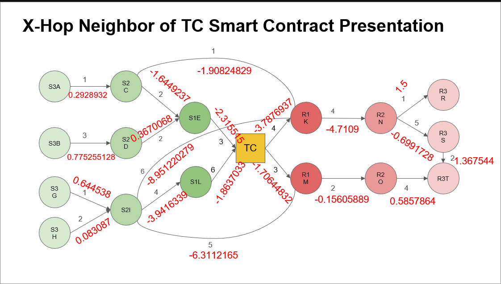

# GNN_Ricci

## Ricci-filled

The Forman-Ricci values are filled by using this formula for every edges in the graph:

 $F(e) = w_e*(\frac{w_{v_1}}{w_e} - \sum_{e_{I, v_1} \sim e}{\frac{w_{v_1}}{\sqrt{w_e * w_{e_I, v_1}}}}) + w_e*(\frac{w_{v_2}}{w_e} - \sum_{e_{O, v_2} \sim e}{\frac{w_{v_2}}{\sqrt{w_e * w_{e_O, v_2}}}}) $

- This graph has no weightes for nodes, my approach is to set every nodes having weight 1 and calculate. However, there are many other options to set weights for nodes such as the number of edges connect to a node (deg_in + deg_out), or using MLP to set value for nodes based on weighted of edges 
- Using this formula for every edges in the graph make some edges that are bidirectional (S2C - R1K, S2I - R1K, S2I - R1M) having two value: 1 value for in-edge and another for out-edge => Proberly wrong. And the image only display one value for those edges.

List of Ricci values --> This list displays every values my code has calculated including two values of bidectional edges (S2C - R1K, S2I - R1K, S2I - R1M):

